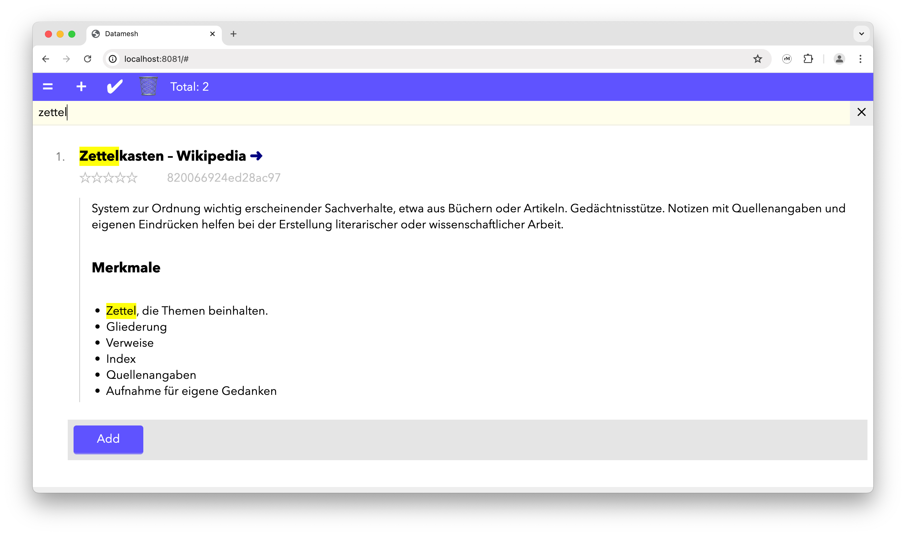

# Datamesh

Datamesh is a simplistic digital Zettelkasten, which helps you to collect and organize information relevant or important for you.

Datamesh is **NOT a password manager**.

The information persisted by Datamesh is **NOT SECURED** in any way.



## Features

- sqlite persistence
- multi panel support
- markdown-like editor (incl. bullet point lists, headlines, simple text decoration)
- linking between articles
- document rating
- filter
- drag and drop
- website title regognition
- multi word tags

## Setup

To create a sqlite DB instance hop into `/src/sql` and run `./init_database.sh` in your bash terminal.

## Run

Use Docker to run a PHP instance containing the webapp.

```bash
docker run -it --rm --name datamesh \
  -p 8081:80 -P \
  -v "$PWD/src/php":/app \
  -w /app \
  php:7.4-cli \
  php -S 0.0.0.0:80 -n -c /app
```

## License

[[LICENSE "See license document"]]
